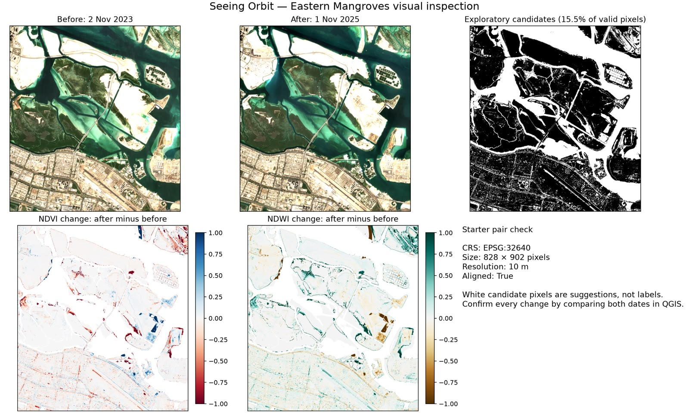

# Progress Log

This log records concrete project outputs and unresolved limitations. Detailed implementation should remain reproducible through scripts or notebooks committed alongside later experiments.

## 30 September 2026

### Eastern Mangroves Exploratory Comparison

- Compared imagery from 2 November 2023 and 1 November 2025.
- Generated NDVI and NDWI difference maps.
- Produced an exploratory candidate-change mask covering 15.5% of valid pixels.
- Used an EPSG:32640 grid with 10 m pixels and an output size of 828 by 902 pixels.
- Confirmed that the two raster arrays share a common grid.

The candidate mask is not a ground-truth label. It includes possible mangrove change as well as potential effects from water boundaries, tide, seasonal appearance, illumination, residual misregistration, and other land-cover changes. Every candidate area requires comparison against both dates and geographic review in QGIS.

`Aligned: True` in the figure means the rasters share a compatible grid. Formal registration still needs to be evaluated using fixed landmarks or independent control points and a reported spatial error.

## 3 October 2026

### Six-Band Sentinel-2 Exports

- Exported six-band Sentinel-2 GeoTIFFs named for 10 December 2018 and 10 December 2025 over Eastern Mangroves; their acquisition metadata still needs to be verified.
- Kept the full raster files outside Git and recorded their filenames, sizes, and SHA-256 checksums in the data documentation.
- Confirmed that the 2018-2025 pair is separate from the earlier 2023-2025 exploratory figure.

### Research and Planning

- Reviewed remote-sensing segmentation and change-detection methods, including SAM-based approaches, U-Net, DECDNet, and classical random forest or SVM baselines.
- Defined QGIS as the quality-control, registration-checking, annotation, validation, and map-production environment rather than the model-training environment.
- Assigned initial responsibilities for registration, segmentation baselines, multispectral exports, and ground-truth investigation.

## Next Steps

1. Record the exact Sentinel-2 collection ID, processing level, scale factors, no-data value, cloud filter, area of interest, and export parameters.
2. Commit the script or notebook that exports the imagery and reproduces the NDVI and NDWI comparison.
3. Validate registration using fixed landmarks and report the error.
4. Review candidate changes in QGIS and separate mangrove change from tide, water, seasonal effects, and unrelated urban change.
5. Define geographically separate training, validation, and frozen test areas.
